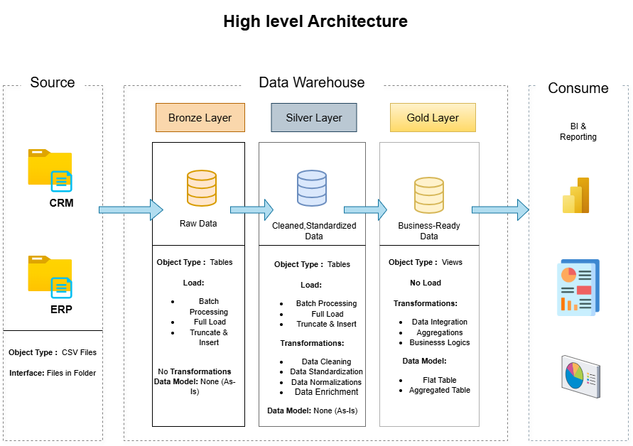

# QuickBite_Crisis_Analysis

Welcome to QuickBite_Crisis_Analysis repository! 🚀

This project showcases a comprehensive and end-to-end data warehousing and analytics solution, designed to transform raw operational data into actionable business insights. It spans the full analytics lifecycle—from data ingestion and cleaning to data modeling, visualization, and strategic recommendations.

## 📖 Project Overview

This project involves:

1. **Data Architecture**: Designing a Modern Data Warehouse Using Medallion Architecture **Bronze**, **Silver**, and **Gold** layers.
2. **ETL Pipelines**: Extracting, transforming, and loading data from source systems into the warehouse.
3. **Data Modeling**: Developing fact and dimension tables optimized for analytical queries.
4. **Analytics & Reporting**: Creating SQL-based reports and dashboards for actionable insights.

## 🏗️ Data Architecture (Data Engineering)

The data architecture for this project follows Medallion Architecture **Bronze**, **Silver**, and **Gold** layers:

1. **Bronze Layer**: Stores raw data as-is from the source systems. Data is ingested from CSV Files into SQL Server Database.
2. **Silver Layer**: This layer includes data cleansing, standardization, and normalization processes to prepare data for analysis.
3. **Gold Layer**: Houses business-ready required for reporting and analytics.

## 📊 BI: Analytics & Reporting (Data Analysis)

Develop SQL-based analytics to deliver detailed insights into:
- **Customer Behavior & ratings**
- **Order & Sales Trends**
- **Citywise Analysis**

   

## 📈 Business Impact

These insights equip stakeholders with critical business metrics that go beyond surface-level reporting. The outputs serve as a foundation for:
* Strategic decision-making during crisis recovery
* Targeted interventions to improve customer experience and operational efficiency.
* Data-backed recommendations that strengthen resilience and guide QuickBite toward sustainable growth.

   
